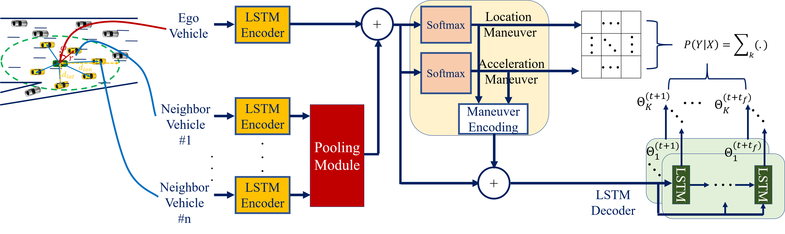
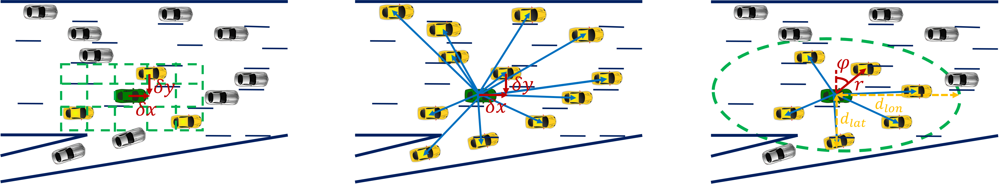

# Maneuver-Aware Pooling for Vehicle Trajectory Prediction
Predicting the behavior of 
surrounding human drivers is vital for autonomous vehicles to share 
the same road with humans. Behavior of each of the surrounding 
vehicles is governed by the motion of its neighbor vehicles. 
This project focuses on predicting the behavior of the surrounding 
vehicles of an autonomous vehicle on highways. 
We are motivated by improving the prediction accuracy when a 
surrounding vehicle performs lane change and highway merging 
maneuvers. We propose a novel pooling strategy to capture 
the inter-dependencies between the neighbor vehicles. 
Depending solely on Euclidean trajectory representation, 
the existing pooling strategies do not model the context 
information of the maneuvers intended by a surrounding vehicle. 
In contrast, our pooling mechanism employs polar trajectory 
representation, vehicles orientation and radial velocity. 
This results in an implicitly maneuver-aware pooling operation.
We incorporated the proposed pooling mechanism into a generative
encoder-decoder model, and evaluated our method on the public 
NGSIM dataset.

#


## Pooling Toolbox
This project helps to reproduce 
the proposed and other pooling approaches such as Social LSTM , Covolutional Social Pooling and Soicla GAN.
#


Visualizing pooling mechanisms (A green vehicle shows the ego, 
yellow vehicle shows a neighbor covered by the pooling strategy,
and grey vehicle shows a non-covered neighbor). 
* Left: a spatial grid is centered around the ego vehicle. 
The social tensor is structured accordingly and populated
with LSTM states of the ego and exisiting neighbor vehicles. 
  The social tensor is used with Social LSTM and Covolutional Social Pooling works.
#  
* Center: relative positions between the ego vehicle and 
  all its neighbors are concatenated to vehicle LSTM states. This is 
  the pooling strategy used in Social GAN work.
#  
* Right: the proposed pooling strategy where vehicle LSTM 
  states are concatenated to relative polar positions 
  (distance and angle) rather than the Cartesian representation
  used by the previous works.
  
## NGSIM Dataset Pre-processing
The NGSIM  public  dataset  is  used  for  our  experiments. The
dataset  consists  of  two  subsets:  [US-101](https://www.fhwa.dot.gov/publications/research/operations/07030/index.cfm)   
and [I-80](https://www.fhwa.dot.gov/publications/research/operations/06137/). 
Download the raw (.txt) files of both subsets, and then run the following MATLAB script:

```
preprocess_ngsim.m
```

This will preprocess the dataset, splits it into train, validation and test subsets, 
and save that to the 'data' directory.

## Model Arguments
The default network arguments are in:
```
model_args.py 
```
You can also set the required experiment arguments in this script. For example: 

* args['ip_dim'] selects the input dimensionality (2D or 3D).
* args['intention_module'] selects whether to predict driver intention.
* args['pooling'] sets the pooling strategy to either 'polar' (our proposed method), 
  'slstm' (Social LSTM), 'cslstm' (Convolutional Social Pooling), or 'sgan' (Social GAN).
  
## Model Training and Evaluation
The model structure is coded in 'model.py'. 
After setting the required experiment arguments, 
you can start model training by running:
```
train.py
```
The output model will be save in 'trained_models' directory.
To test a trained model run:
```
evaluate.py
```
which will load and test the trained model defined by the selected model arguments. The RMSE results will be saved as csv files to the 'evaluation' directory. 
